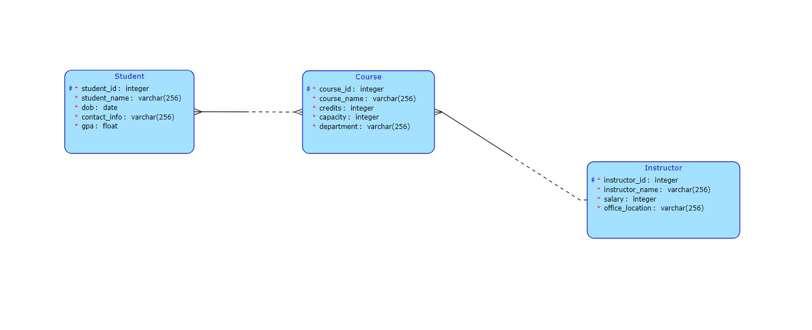

Topic: Academics Management System

Model: 

Query: Select a list of instructors(with the course names they teach) who are interacting with a specific student. (output is all the attributes in Instructor entity with course name)

Business Logic Operation: When an instructor tries to publish a new course, check if the workload of the instructor will pass the threshold by calculating the amount of students in total the instructor is teaching plus the capacity of the new course. We will add the course only if the condition satisfies.

For Server - run the application on Intellj IDEA Ultimate

Complex Query is in the details of each student in students page. (Marked by details icon)

Business Logic Operation is in the details of each teacher and there will be a create course button.
